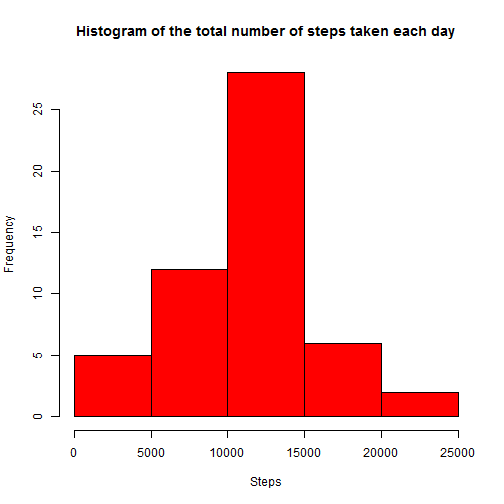
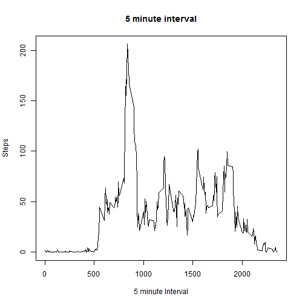
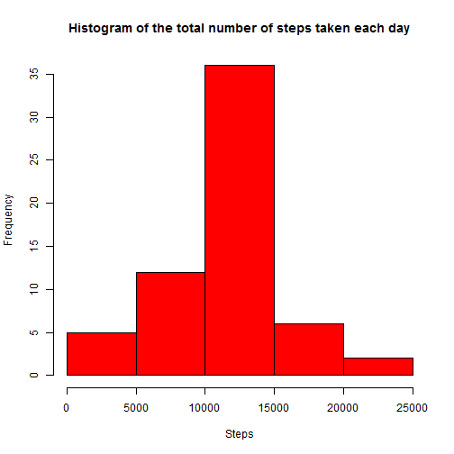

# Reproducible Research: Peer Assessment 1


## Loading and preprocessing the data

```r
setwd("c:/data/Rdata/RR")
ds <- read.csv("activity.csv")
sum_steps <- aggregate(steps ~ date, data = ds, sum)
```


## What is mean total number of steps taken per day?

```r
mean(sum_steps$steps, na.rm = T)
```

```
## [1] 10766
```

```r
median(sum_steps$steps, na.rm = T)
```

```
## [1] 10765
```

```r
hist(sum_steps$steps, col = "red", main = "Histogram of the total number of steps taken each day", 
    xlab = "Steps")
```

 

## What is the average daily activity pattern?

```r
av_steps <- aggregate(steps ~ interval, data = ds, mean)
plot(av_steps$interval, av_steps$steps, type = "l", xlab = "5 minute Interval", 
    ylab = "Steps", main = "5 minute interval")
```

 


Which 5-minute interval contains the maximum number of steps:
  

```r
maxsteps <- which.max(av_steps$steps)
av_steps$steps[maxsteps]
```

```
## [1] 206.2
```

```r
av_steps$interval[maxsteps]
```

```
## [1] 835
```


The interval 835 contains the maximum number of steps.
## Imputing missing values

```r
sum(is.na(ds))
```

```
## [1] 2304
```

Fill the missing values with the average value of the 5-minute intervals

```r
ds2 <- ds
ds2$steps[is.na(ds2$steps)] <- sapply(which(is.na(ds2$steps)), function(intv) mean(ds2$steps[ds2$interval == 
    ds2$interval[intv]], na.rm = T))
sum_steps2 <- aggregate(steps ~ date, data = ds2, sum)

hist(sum_steps2$steps, col = "red", main = "Histogram of the total number of steps taken each day", 
    xlab = "Steps")
```

 

```r

mean(sum_steps2$steps)
```

```
## [1] 10766
```

```r

median(sum_steps2$steps)
```

```
## [1] 10766
```

Wow, the mean and the median are the same.

## Are there differences in activity patterns between weekdays and weekends?

```r
ds2$date <- as.Date(ds2$date)
ds2$w <- NA
ds2$w <- ifelse(weekdays(ds2$date) %in% c("Saturday", "Sunday"), "weekend", 
    "weekday")
intv_steps <- aggregate(steps ~ interval + w, data = ds2, mean)
library(lattice)
xyplot(steps ~ interval | w, data = intv_steps, type = "l", layout = c(1, 2), 
    xlab = "Interval", ylab = "Number of steps")
```

 

It looks like there are differences in activity
patterns between weekdays and weekends.
It seems like people are more active during the weekend. 
People behind their computer at the office during the weekdays?
During the weekdays the peak is higher 
People go to work?.
